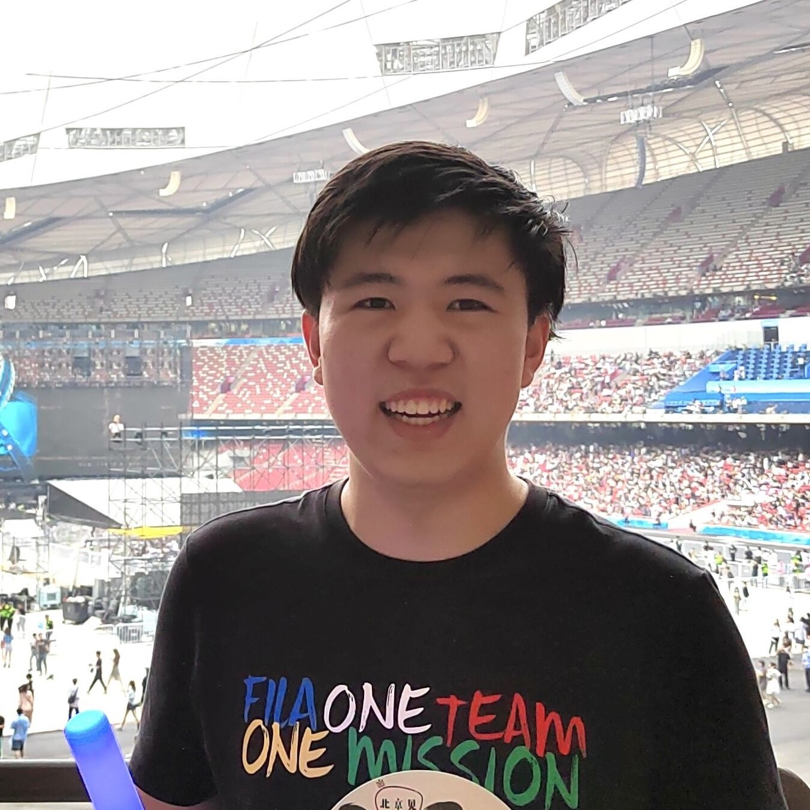

  

    
  

  

    

      <h5>I'm WU Yushen (吴宇深), a junior student in Yao Class, Tsinghua University. My major is Computer Science and I'm also studying for a minor degree of math at Department of Mathematics Science & Qiuzhen College.</h5>
      <h5>My interest lies in the research of numerical algorithms and physics-based simulation. I have had rich experiences in C++ programming and numerical programming using Matlab and Python.</h5>
      <h5>Currectly, I'm carrying out researches about linear equations solver for PDEs from simulation, under the instruction of <a href="https://people.iiis.tsinghua.edu.cn/~taodu/">Prof. Tao Du</a>.</h5>
    

  

- Email: [wu-ys20@mails.tsinghua.edu.cn](mailto:wu-ys20@mails.tsinghua.edu.cn)

- Website: [wu-ys.github.io](https://wu-ys.github.io)

- Codestats (since Jan. 31, 2023): [https://codestats.net/users/wu-ys20](https://codestats.net/users/wu-ys20)
